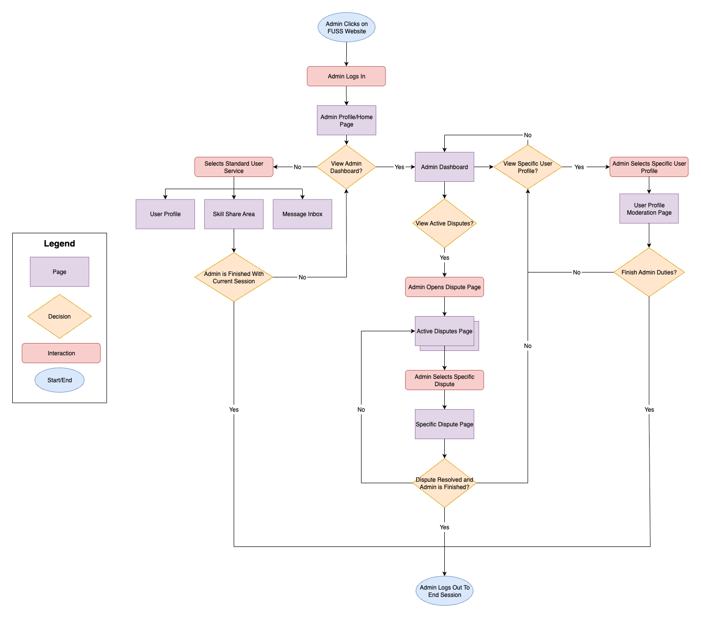
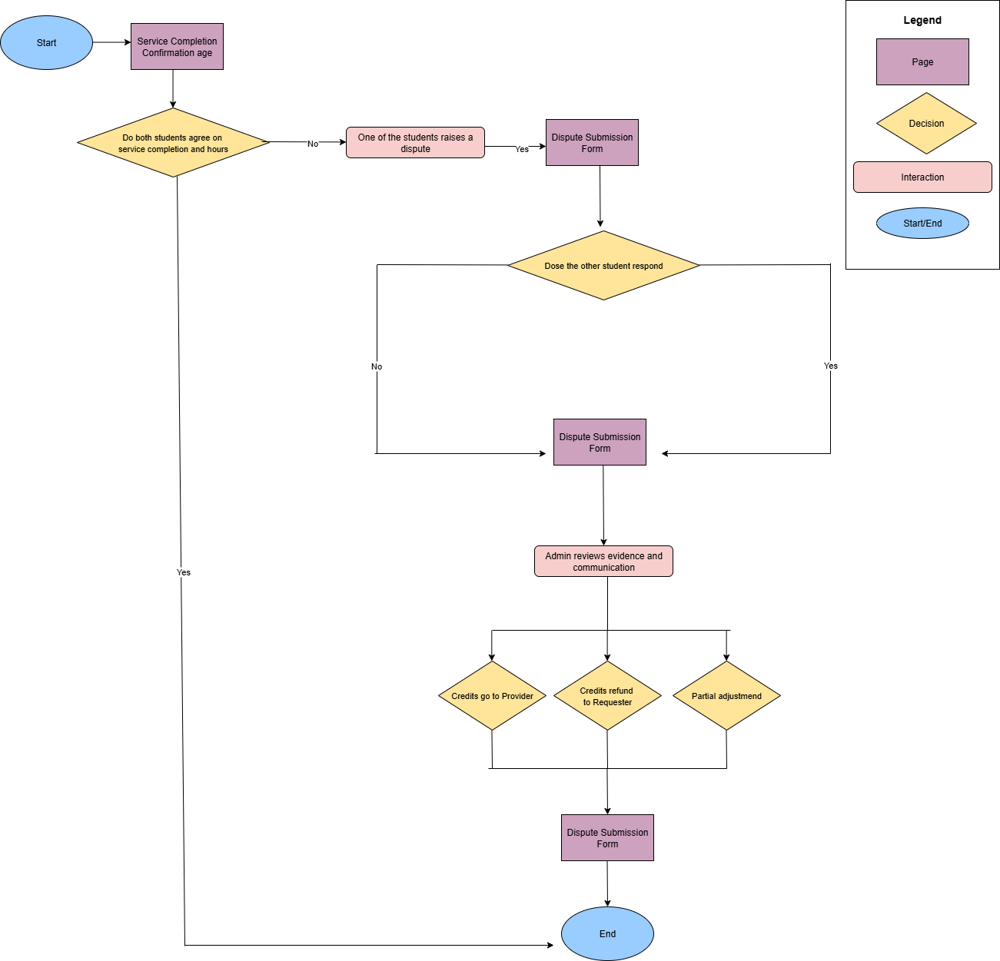
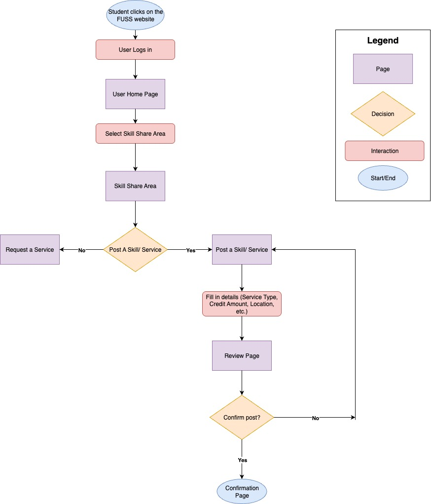
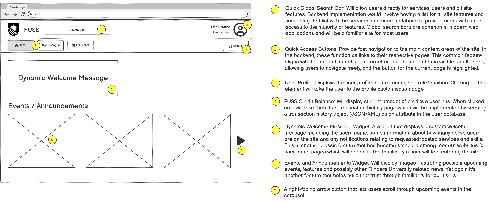
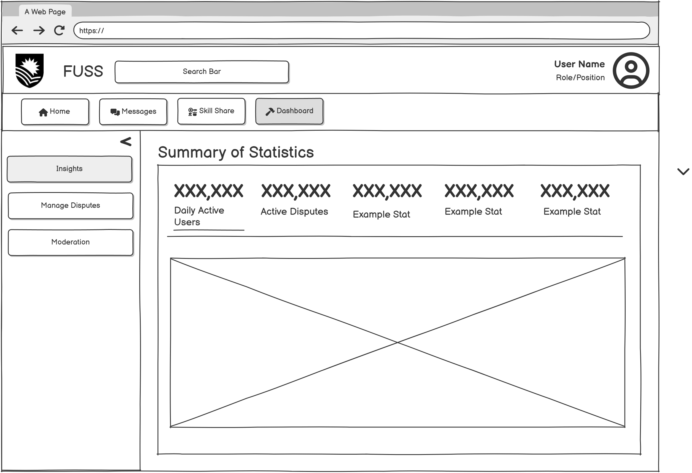
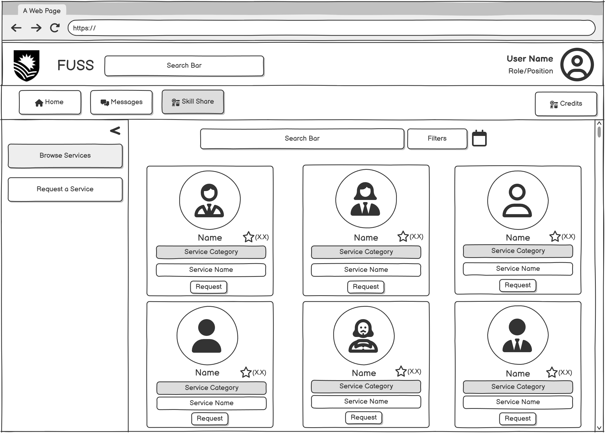

# User Research for Group 8 COMP2030

This document will contain all relevant sections and deliverables for the user research p1 assignment.
The following table will indicate which lines relate to which group members:

| Student Name  | FAN      | Sections                                                                                            | Lines |
| ------------- | -------- | --------------------------------------------------------------------------------------------------- | ----- |
| Oliver Wuttke | WUTT0019 | Project Proposal, Research Methods, Sitemap, Userflow Admin, Both Simple Storyboards and Wireframes |
| Hans Pujalte  | PUJA0009 | Persona Student, Competitor Analysis, Userflow Browsing Service, 1 Complex Storyboard, Wireframes   |
| Luke Lewis    | LEWI0454 | Persona Tutor, Userflow Posting Service, 2 Complex Storyboards, Wireframes                          |
| Seth Lear     | LEAR0022 | Persona Admin, Userflow Dispute, Paper Wireframes, UX Research, Wireframes                          |

Project Structure:

- **Project Proposal:**
  - Website Concept
  - Target Audience Profile
  - Scope Statement
- **User Research Report:**
  - Research Methods
  - User Personas
  - Competitor Analysis
- **Information Architecture:**
  - Sitemap
  - User Flow Diagrams
- **Low Fidelity Wireframes:**
  - Wireframes
  - Storyboards
    - 2 Simple, 3 Complex

---

# Project Proposal

---

This document serves as a project proposal for the Flinders University Skill Share (FUSS) website.
This document is specifically for the project proposal for COMP2030 Group 8 Semester 2, 2025.

---

## Website Concept

The Flinders University Skill Share website will serve the purpose of empowering Flinders University students with a skill exchange marketplace.
This marketplace will allow students to advertise and seek a variety of services from other students in exchange for FUSSCredits.

> Definition: FUSSCredits are a time based virtual currency in which 1 FUSSCredit can be exchanged for an hour of a given service.

This solves the problem of there not being a standardised and official channel for this kind of student interaction.
It won't only protect students from being scammed out of their services but protects students seeking services as well.
This will be enforced through administrator moderation and reputation systems.
Not only will this solve the problem of safety and trust, but it will also provide students with the unique opportunity to advertise their services to the broader university community.

---

## Target Audience Profile

Our primary target audience will be consisting of undergraduate Flinders University students.

### Demographics and Background:

- Age Range: 18-25+
- Gender: All genders
- Location: Within the Adelaide area but some users will be out of state and/or country.
- Year of Study: From first years to PhD's.
- Type of Study: Full-time, part-time and deferred students.
- Area of Study: All fields of study (STEM, Social Science, Art and Humanities ect…).

### Behaviors and Preferences:

- Device Preference: Laptop/Desktop because all University students are required to own/have access to one.
- Communication Preference: Informal 'text message' style of communication.
- Mental Model: Will be familiar with existing Flinders University online services such as FLO and Okta Apps.
- Attention/Memory: Longer attention/memory span for tasks that users 'want' to do compared to mundane/boring tasks.

### Needs and Constraints:

- Socioeconomic Condition: University students often do not have a lot in any disposable income therefore they would be considered lower on the socioeconomic ladder.
- Technical Ability: Low to average technical ability.
- Availability: Will vary extremely from user to user.
- Motivations: To improve academically and professionally.
- Trust: Students may be skeptical/distrusting of student provide services without credibility.

### Accessibility Considerations:

- Colour blind colour schemes.
- Short/long-sightedness, blindness.
- Deafness.
- Physical impairment (lack of sense of touch).
- Mobility issues (wheelchair, limbs, head movement).

---

## Scope Statement

This section will include key features and content areas alongside simple backend implementations for certain functionalities.

### Key Features:

- Secure registration and login/logout session management.
- Student profile customisation.
- Search and browse skills and students with advanced filtering with weighted relevance.
- Recommendation engine.
- Student requesting a specific service.
- Service fulfillment and FUSSCredit transfer validation.
- Peer review system including a trust and reputation system.
- Advanced availability and scheduling integration.
- Internal peer to peer messaging.
- Real time notifications.
- Admin control dashboard.
- Student management including advanced dispute resolution and mediation tools.
- FUSSCredit moderation.
- Skill and category management.
- Content moderation.

### Content Areas and Backend Implementations:

---

**User Registration and Login/Logout Session Management:**

User registration will be handled through an option on the welcome/login page where if a potential user wants to create an account they will navigate to a sign-up/new user section.
Here they will be directed to enter certain information which will be validated against a database of current users to ensure this is truly a new user.

For existing users that same login/welcome page will include a sign-in form where users will enter an email/username and a password.
That information will be validated against the user database whereupon validation a session token will be generated for that users current login session.
This token will be used in all request sent by the user to validate the session and when a user 'times out' or logs out that session token will be destroyed and new one created upon the next login session.

---

**Student Profile Customization and Management:**

Students will be able to customise their profile with certain details (name, course, academic year, bio, profile picture and more).
This will be implemented similar to how most social media platforms enable user profile customisation and will try to match that same mental model to make the process as frictionless as possible.

Students will also be able to list their currently available skills and services and the types/categories of these skills and services.
In addition to what skills a student has to offer they will also be able to list particular services and skills they seek for themselves.
These options will be made available through the same form/page that they will use to customise their profiles.

Students will also be able to see their current FUSSCredit balance alongside a transaction history.
This information can be stored as attributes within the user database to ensure the validity of balance and transaction history.

---

**Peer Skill Exchange Mechanics and Functionality:**

Students will be able to search and browse for services with advanced filtering alongside a recommendation engine.
Students will have a variety of drop-down style menus to perform advanced filtering.
A recommendation engine will look at student transaction history and preference set by the student to find better matches for that student.
Proximity matching will look at what areas students have listed for available services and match that up against the area in which the service seeking student is located in to filter results by distance as well.

A student will also be able to request a service from another student who offers that skill.
The requester can specify stuff like time and date, estimated time for the service and a short message.
Provider will then have the option to accept that request or send a counter-offer which the requester can accept.
This functionality will be handled through a variety of webforms where a history of the 'conversation' will be logged for in-case admin intervention is needed.

Service fulfillment will be determined by if both parties agree that the service was completed after the service has been completed.
After confirmation by both the requester and provider are verified the credits will be transferred.
Before a service is requested the requestee will have their balance checked (server side) to ensure enough funds are available for the service.

A trust and reputation system will be in-place alongside a service review system to ensure the credibility and reputation of the service provider.
Users who have used a service will have a period of time to leave a review and 'rate' the service provider.
These metrics will be displayed on the service providers profile alongside their advertised service.

---

**Scheduling and Communication:**

Students will be able to provide a schedule for their services.
This schedule will be integrated into a calendar where students can see their services they have requested and any service they need to provide.
This calendar will also be able to detect conflicts in bookings and warn/not let the user 'double book'.

A simple internal messaging system will also be inplace for students to directly communicate with one another.
The possible use of web-sockets will allow the platform to have real time messages and notifications so users don't need to actively refresh the page.

---

**Administrator Features:**

An admin dashboard will be the first thing an admin sees when they log in.
This dashboard will show a summary of stats related to active users, active disputes, FUSSCredit balances and much more.

An admin will also have the ability to view, edit, suspend and ban student accounts as needed.
There will also be advanced dispute resolution and mediation tools.
These tools will provide admins with full logs of the two disputing parties interaction as well as full profile history and other summary statistics to provide the admin with enough information to make fair and informed decisions.
The admin will also be able to freeze and adjust the FUSSCredits on the accounts of the disputing parties until a resolution is found.
Finally the admin will have the power to decide the outcome of the dispute.

Admins will also have the ability the manage categories and skills, in the sense that they can decide what is allowed to be offered and what categories are available and too which skills they encompass.

Admins will also have moderation tools that will allow them to remove and/or edit student listings and profiles if inappropriate content is reported or detected.

---

# User Research Methods

---

This section will contain a variety of user research methods that will be used to help the development team gain a deeper understanding of our target user groups.
Our goal is to have a variety of research methods that can be used at different stages of the development lifecycle in order to be constantly taking on user feedback and using that feedback to make valuable improvements and features.

---

## User Interviews

User interviews will give us the opportunity to have one-on-ones with users and really probe for specifics, general opinions, and engage in an open-ended conversation about the overall user needs, wants and pains.
Interviews do have their drawbacks, depending on whether they're conducted in person or not can really change the kinds of answers and how we may interpret them.
This is why we believe in conducting in-person interviews to try and truly gage the users emotions and attitudes about FUSS and how we can accommodate them with the best user experience possible.
We believe this process will take somewhere around a month in total given by:

- 1-2 weeks for planning.
- 1 week to conduct the interviews.
- 1 week to compile and interpret results.

Overall we believe that the opportunity for one-on-one conversations with our users is too invaluable to pass up.
It would give us deep insights into what our users truly think which is something that may be missed in other methods mentioned.

> ### Example Interview Questions:
>
> 1. What would make you feel confident participating in a skill exchange with someone you don’t know?
> 2. Walk me through how you would ideally find someone with a skill you need at Flinders University.
> 3. What features and services would make you come back and use the website again, rather than just once?

---

## Surveys

Just like interviews surveys have a long history of being one of primary methods of gaining feedback on a product.
But unlike interviews surveys are typically less personal and more general than interviews, but that isn't necessarily a bad thing.
Whilst a survey can't go as indepth as some other research methods it is a great tool for gaining a more general consensus about user opinions on a larger scale.
What surveys lack in personalisation they make up for in shear volume and ease of creation.
In terms of timeline we can see something similar to interviews with the total length being roughly one month given by:

- 1 week for planning and writing.
- 1-2 weeks for conducting the surveys.
- 1 week to compile and analyse the results.

Surveys can be effectively used at multiple stages of the development cycle to gain quick feedback on new features whilst also being used in a more general user sentiment context as well.

> ### Example Survey Questions:
>
> 1. How would you rate the overall Skill Exchange experience here on FUSS: Rate 1-5 (Would be asked after a successful order).
> 2. Could you please provide any feedback on the overall user experience on FUSS: Open ended (Could be asked at the end of all surveys as a sort of 'catch-all').
> 3. What would be the likelihood of you reusing FUSS in the future: Slider with multiple options.

---

## Usability Tests

Usability tests will help the development team bridge together technical functionality alongside delivering on project goals.
These tests will give us the opportunity to test a variety of features/elements in a way that won't negatively effect the entire userbase.
These tests will be running during the prototype/early development stages which will helpful in finding issues early that could cause big pains downstream.
It will also give developers an insight into how a non-technical person naturally navigates our site and could lead to interesting discoveries around our target users existing mental model.
Time frame for usability tests is similar to other research methods taking approximately one month given by:

- 1 week for planning and writing the tests.
- 1 week for running the tests.
- 1-2 weeks for analysis and interpretation of results.

We believe that usability tests fill the gap that our previous two research methods have left in terms of user feedback.

---

## Card Sorting

Card sorting is an exercise where participants are given topics on cards and are then asked to sort those cards into groups that are meaningful to them.
This technique could help the development team uncover previously unknown connections between themes and topics and to what user groups they provide the most meaning to.
Our development team can use this information to more carefully curate features for specific user groups based on this exercise.
A drawback is that it may be difficult choosing these topics initially but our previously mentioned research methods may help with narrowing down these topics.
A typical timeframe for this exercise is yet again around one month given by:

- 1 week to plan and prepare.
- 1 week to conduct the exercises.
- 1-2 weeks for analysis and interpretation of results.

We believe this research method will be most useful when used alongside and with the previously mentioned methods.
Card sorting is a unique way to try and get meaningful information about our different user groups, but it will help us truly understand the needs, wants and pains of our different user groups.

> ### Example Topics for Card Sorting:
>
> - Post a skill I can offer.
> - Browse for skills I would like to use.
> - Academic tutoring.
> - Creative skills.
> - Technical skills.
> - Create/update my profile.
> - Show my available skills that I offer.
> - Display wanted/seeking skills.
> - Moderation of user content.
> - Safe dispute system.

---

# Personas

When conducting user research the idea of personas is to have a 'made up' person for each of our target user groups.
These personas would often be displayed in the same room or be accessible to developers throughout the development cycle.
This in turn will act as a constant reminder of who we are developing for at each step in the process.

## The Student

  
Student Persona

  

  
Student Persona Essay

  

## The Administrator

  
Admin Persona

  

  
Admin Persona Essay

  

## The Tutor

  
Tutor Persona

  

  
Tutor Persona Essay

  

---

# Competitor Analysis

## 1. [StudyTogether](https://www.studytogether.com/)

StudyTogether is a website where students around the world can connect, learn, teach, share, and help each other through a virtual community of over 500,000 students. Students can join different study rooms, including solo and group study rooms, directly on the StudyTogether website.

While StudyTogether is not a direct competitor to FUSS, both platforms share a common focus on student support and peer-to-peer collaboration. Neither relies on money as the primary form of exchange. Instead, each replaces it with an alternative system. For instance, StudyTogether fosters collaboration through shared study spaces, while FUSS uses a credit-based model for exchanging skills and services. Although StudyTogether is primarily geared towards academic support and productivity, and FUSS emphasises broader skill and service exchange, both platforms aim to strengthen community, collaboration, and mutual support among students.

### Key Features

- Study rooms can be customised with a wide range of features, including atmospheric backgrounds, personal timers such as pomodoro timers, binaural beats, and goal-setting tools to enhance productivity.
- Students can create study rooms with participants from specific backgrounds or areas of study, allowing for more targeted support.
- Users can connect with other students worldwide. Platform is accessible 24/7.
- Free expert community tutors can join study rooms and provide academic assistance when needed.

### Strengths

- Completely free and virtual, making the platform highly accessible to all students regardless of their financial situation.
- Study-oriented and productivity-focused. Students can get support at any time of the day or night since the platform is 24/7.
- Students can get help from multiple peers simultaneously, enriching learning through fresh and varied perspectives.

### Weaknesses

- Potential moderation and safety concerns with joining study rooms with strangers, especially in a large, open community.
- Lacks specialised tools for collaboration such as shared documents, exam prep, or structured learning models.
- No guarantee of expertise among users in study rooms. This may affect student productivity, quality of help, and reliability of work. Additionally, quality of interactions may vary depending on who is present at a given time.
- The large, global community may make it difficult for students to develop meaningful connections or form smaller, more focused study groups.

---

## 2. [Upwork](https://www.upwork.com/)

Founded in 2014, Upwork is a global online platform that connects businesses and individuals with freelancers offering a wide range of services. The platform streamlines the hiring process, making it straightforward for clients to find skilled professionals and for freelancers to secure work. As of 2025, Upwork hosts over 18 million freelancers across more than 180 countries, with approximately 841,000 active clients.

While Upwork is not a direct competitor to FUSS, it serves a similar function in connecting people who need specific skills or services with those who can provide them. The key difference lies in the transaction model. FUSS operates on a credit-based exchange system within a university community, whereas Upwork is a cash-based, professional marketplace. Despite this distinction, both platforms share comparable features, such as reputation systems, profile creation, and structured job or service requests.

### Key Features

- Clients can create job listings for free, specifying requirements and budgets. They can also post jobs on the marketplace to receive freelancer proposals. Upwork’s AI-powered matching system recommends candidates who best fit the role.
- Once a project is completed, clients can leave detailed feedback within 14 days of the contract ending. Upwork uses a double-blind system, meaning neither party can view the other’s feedback until both have submitted. Ratings include specific criteria such as quality of work, a 1–5 star system, and written reviews.
- Freelancers can showcase their skills and experience through their profile, including work samples, testimonials, and portfolios. Clients may verify portfolios at any time.
- Payments are secure and managed directly through Upwork. Using an escrow system, funds are held until both parties confirm that the project has been completed to their satisfaction.
- All-in-one platform for managing the entire freelance process, with built-in tools for communication (chat and video calls), project management (milestones), and systems for security and trust.

### Strengths

- No upfront cost to start. Both clients and freelancers can get started for free, with access to millions of freelancers and thousands of clients worldwide, creating a large pool of opportunities.
- Employers can quickly and easily hire talent from anywhere in the world, often gaining access to specialised skills or lower-cost services not available locally.
- Work can be priced by the project or on an hourly basis, giving flexibility to both clients and freelancers. Freelancers can also adjust pricing based on experience, demand, and complexity.
- Strong reputation and feedback system builds trust and credibility for both clients and freelancers.

### Weaknesses

- Large freelancer base creates intense competition, making it difficult for newcomers to secure their first contracts. New professionals often struggle to stand out until they establish a portfolio and client history. Freelancers from lower-cost regions can undercut pricing, further raising the entry barrier.
- Upwork charges service fees to both clients and freelancers, typically ranging from 0%–15% of the project cost. These fees can significantly reduce freelancer earnings, especially for lower-value contracts.
- Fully virtual model. Lack of any in-person component may limit personal interaction, trust-building, and certain types of services that rely heavily on physical presence or face-to-face collaboration.

---

# Sitemap

  
Sitemap

  

---

# User Flow Diagrams

User flow diagrams are used to show all the possible choices/paths that a user will encounter and there outcomes for a given task/flow.
These provide developers with insights into the complexity that certain tasks may require and also allow us to try and simplify and remove friction from those tasks.

## Admin Work User Flow

  
User Flow for General Admin Workflow

  

## Service Browse User Flow

  
User Flow for a Student Browsing and Selecting a Service

  

## Dispute from User Perspective User Flow

  
User Flow Showing the Student Perspective in a Dispute Process

  

## Posting a Service User Flow

  
User Flow Showing the Posting of a Service

  

---

# Wireframes

Single instances of webpages with annotations for functionality, design choices and backend implementations.
These are the closest thing we get to what our site pages will look like before they are actually coded.
This section will contain first paper wireframes alongside certain user experience design choices.
Then a series of annotated and unannotated low fidelity wireframes.

## Paper Wireframes

Initial sketches that inspired the complete versions and storyboards.

  
Paper Home Page

  

  
Paper Admin Page

  

  
Paper Service Request Page

  

  
Paper User Profile Page

  

### Justifications for Design Choices

Home Page: Page Layout and Mapping: Miller Law focuses on how the average person can only focus on $\pm$ 7 items in their working memory at a time. From this we have decided to limit the number of objects that the site will have to navigate with on all our pages to reduce the amount of cognitive load on the users. The reason we have done this is to make it easier for users to achieve their goals and increase their success rates leading to more engagement on our site.

Left Hand Menu: By following Jakobs Law, we realise that users spend more times on other websites then ours. From this we made the menu to navigate to other pages on the left-hand side of our site, because this is what our users are more familiar with. With this we also plan to further develop our site, from this we have taken consideration backend features we wish to implement. One of the features we wish to implement is while the user scrolls down the left-hand side menu will stay in place allowing easier navigation for our users to navigate between our pages.

Area’s of Study: With our model we have also considered Hick's Law with the number of available options available on our screen at a time. We have realised from this that more complex and busy interfaces lead to longer decision times After conducting research and looking at other websites as well, often they only have 3-4 options available for the user to select and then have a button to go to the next page for more options to again reduce cognitive load on the user.

Search Bar: With our search bar, in the pre-production of our site we have taken into consideration some of the backend features we will wish to implement later on, one of these being an advanced search filtering. From this as a user searches on our site based off of previous searches the user will have searches suggested to them based of what they have previously engaged with.

Advanced Recommendations: At the bottom of our page, with our site we look to implement an advanced recommendations system for jobs. This being similar to the search bar, these requests would be based off of what the user has recently and previously engaged with. As well these would be similar requests of jobs that the user has completed before as we as being requests our user is more likely to engage in and complete.

User Profile Page:
Skill Share Section: With this after conducting research on various sites and seeing the site layout of them. Again, Jakob’s Law states how users spend more time on other pages so adjusting out site to fit the users will allow for the users to have a more successful interaction with our site. From this by having the skills at the top of the page it is easy for the user to navigate as they are used to this layout. With the image in the middle on other sites they often have either and image or text first and then the other to break up the information for less cognitive load on the user. With this section as well we factored in Miller law about users attention span and from this decided to only list three skills at a time and added a button for the user to press for them to view more skills.
Reviews Section: For the reviews section again Jakob’s law was considered because with most websites the reviews section is down near the bottom of the page to allow for all the relevant information to be first then followed by reviews on the user.

Admin Dashboard:
User Profile Section: With our admin dashboard we tried to apply Hick’s Law to reduce the number of decisions an admin would need to make in regard to a user’s account. From this we have decided to limit it to only a few options being:

- Pause
- Delete
- Suspend

By trying to keep this to three options we have made it less complicated to deal with users if they are misbehaving on our site. We have also done this to keep it easy because in some cases it can be extremely difficult for an admin to be able to deal with a user’s account so by implementing Hick’s Law, we have kept the process of dealing with user simple until the issue is resolved.
Dashboard: With the admin dashboard Jakob’s, Miller’s and Hick’s Law were all relevant. With Hick’s Law we kept the dashboard about how the site is operating simple, so they were able to easily with how the site was running. Miller’s Law, we kept the number of statistics you would view at a time limited to three to allow the user not to be overwhelmed. We also based the dashboard off other sides to allow admins from other sites to be able to pick up and understand how our website worked quickly.
Request a Service:

Request Form: With the request form all Laws were considered when making this page. We used Hick’s Law and limited the number of options available for the user to enter to keep the request form easy to view and adjust if any adjustments are to be made such as adjustment of FUSS Coins or time allocated to complete the job. With the from we tried to keep it simple and used bigger headings to clearly indicate what section the user was filling out. Again, by using Miller’s Law we kept the amount of information a client would have to fill out to approximately 6-7 which is what Miller suggest the number of items a person can process at a time in their working memory.

Messages: With the messaging system we used elements that other chat systems have used to implement Miller’s Law and keep the point of communication between clients and user simple. We did this by having the chat between users take up majority of the page meaning less cognitive load on the user. We also used Jakob’s law and kept all conversations that the user has had with previous users on the left which our users are use to from previous websites they have used.

---

## Annotated Wireframes

This section will include 6 low fidelity wireframes WITH annotations.

  
User Home Page

  

  
Admin Home Page

  

  
Profile Customisation Page

  

  
Posting a Service Page

  

  
User to User Messaging Page

  

  
Dispute Resolution Page

  

## Extra Unannotated Wireframes

Some bonus wireframes without annotations.

  
Admin Dashboard

  

  
Browse Services/Skills Page

  

---

# Storyboards

Storyboards are a great tool for showing what a user might see and experience whilst trying to complete a task/flow on our website.
They use a series of wireframes alongside text describing what actions the user had to take to arrive at them.
We have included 2 simple storyboard (3-5 wireframes) and 3 complex storyboards (6+ wireframes).

## Simple Storyboards

  
A storyboard showing the posting of skill/service

  

  
A storyboard showing user to user messaging

  

## Complex Storyboards

  
A storyboard showing how a user would 'order' a service/skill

  

  
A storyboard showing how a user would request a specific skill/service

  

  
A storyboard showing how a dispute process would happen and be resolved

  

---

# Summary

We have displayed a vast array of different research methods that have given us a deep understanding into the pains, wants and needs of our target user groups.
This understanding has influenced our design choices at every step of the way to ensure we deliver the best possible user experience to our students, tutors, admins and any other user of our service.

---

# References

Tools Used:

- [Figma](www.figma.com)
- [Balsamiq](www.balsamiq.com)
- [Draw.io](www.draw.io)

References for Competitor Analysis:

- Upwork 2025, Upwork | Hire Top Freelance Talent with Confidence, Upwork, viewed 23 August 2025, <https://www.upwork.com/>.
- Study Together 2020, We are creating a world where everyone enjoys learning | Study Together, Studytogether.com, viewed 23 August 2025, <https://www.studytogether.com/about>.
- Morozov, V 2024, Work on Upwork: Pros and Cons (Our Honest Review), Luxequality.com, viewed 23 August 2025, <https://luxequality.com/blog/work-on-upwork-pros-and-cons/>.

Image References for User Personas:

- Dominican University of California 2022, ACS Student Thriving With Real-World Experience, Dominican.edu, viewed 25 August 2025, <https://www.dominican.edu/news/news-listing/acs-student-thriving-real-world-experience>.
- Kaspersky 2025, Women in the spotlight: how to tackle rising cybersecurity risks?, Women in cybersecurity — Kаspersky report.
- Shutterstock 2023, Young Asian student at school, Shutterstock.
