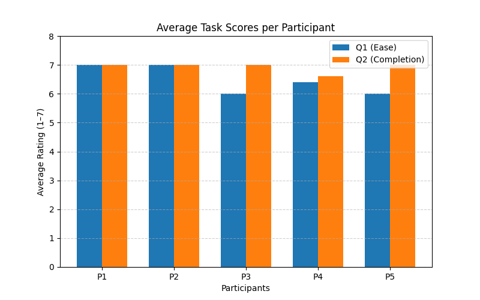
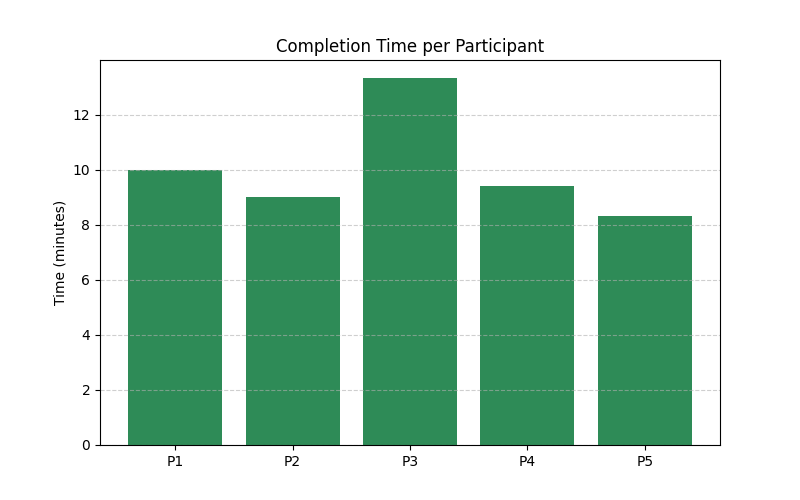

# Usability Testing Report COMP2030 Group 8
**Group Members**

| Name          | FAN      | Sections                            |
|---------------|----------|-------------------------------------|
| Oliver Wuttke | WUTT0019 | Test Plan and Iteration Description |
| Hans Pujalte  | PUJA0009 | Analysis and Summary                |
| Luke Lewis    | LEWI0454 | Analysis and Summary                |
| Seth Lear     | LEAR0022 | Test Plan                           |
****
## Table of Contents
- [Introduction](#introduction)
- [Test Plan](#test-plan)
- [Summary and Analysis](#summary-and-analysis)
- [Iteration Description](#iteration-description)
- [Appendices](#appendices)
  - [Appendix 1](#appendix-1-script---instructor-copy)
  - [Appendix 2](#appendix-2-script---participant-copy)
  - [Appendix 3](#appendix-3-usability-test-results)
  - [Appendix 4](#appendix-4-tables-and-figures)

****
## Introduction
This report contains developmental insights into the FUSS website's features and design choices and how they can be improved.
The user experience evaluation has a focus on core functionality for both regular users and administrators and with a primary focus on the ease of navigation whilst performing tasks on the FUSS website.
Five scenarios have been created to help us test and improve the usability of the FUSS website.
****
## Test Plan
When conducting our tests, when asking our testers to fill out information about themselves, from these three of our four testers are enrolled in Computer Science degree. With this we saw our testers were in the age range of 16–30 and were very confident in using a new web application; however, none of them had ever used an online skill exchange application before.

Specific Tests Conducted:
Test 1: Posting a skill
-	Navigate to a post-service section
-	Fill in form ensuring timeslots are filled
-	Confirm Skill posted

Test 2: Delete a user
-	Login with admin credentials
-	Navigate to Dashboard then User Management
-	Hover over the options' button on a user, then select delete
-	Confirm deletion by selecting yes

Test 3: Create an account
-	Sign up
-	Enter valid credentials
-	Fill in form, agree to T’s and C’s
-	Enter your new username and password

Task 4: Book a service
-	Skill share
-	Select Skill
-	Select time
-	Confirm booking

Task 5: Confirm booking and leave a review
-	Skill Bookings
-	Service Complete
-	Fill in form
-	Submit review

For the methodology of our site, we used a pre-test demographic questionnaire to find our information about our users. From this we asked questions regarding our testers' background knowledge with using web applications and if they had used a skill share service before. With this we use a SUS at the end of our tests to receive feedback on how easy tasks were to complete, one being not confident, and five being very. We also used SEQ’s at the end of the test so the user could sum up their experience with the tasks. With this we also asked our testers to leave other post-test questions, so we were able to receive more feedback on our application.

With our Metrics for success, we measured success by if they completed the task successfully, their navigation efficiency and SUS score. With this we measured success by at the end of each test asking our users to provide a score out of five as to how they found the task and how confidently they completed the task. We measured success by how users navigated to the task and how easy to find the menus to navigate around the site.
****
## Summary and Analysis
The usability tests were conducted to assess how easy and effective users found the FUSS website, as well as to identify any common issues experienced during use. Both qualitative and quantitative data were collected to measure overall success and highlight potential areas of improvement. Five participants, aged between 16 and 30, took part in the testing phase, each with diverse educational and occupational backgrounds. Importantly, none of the participants had prior experience with online skill exchange marketplaces, providing valuable insight into how first-time users interact with the site. Each participant completed a set of five tasks representing typical system interactions, such as logging in, posting a skill, and booking a service. The testing process also included pre-test demographic questions, task performance evaluations, and post-test System Usability Scale (SUS) questionnaires to capture user perceptions. Observations and direct feedback were documented throughout the sessions to help identify key usability strengths, recurring challenges, and opportunities for refinement.

### Summary of Results
**Areas of Success**

All participants successfully completed all tasks as intended, indicating that the platform is generally functional for new users. Task performance scores were consistently high for ease of use and success of task completion, with all users giving a score above 6.

The average completion time ranged between 8 and 13 minutes, with most tasks completed smoothly and with minimal assistance. One participant reported that the website was “really well-designed” and believed that “a lot of university students would use a system like this.” Several users also tested extra functionality beyond the assigned tasks, suggesting confidence and interest with other components of the site.

Participants recorded strong SUS scores ranging from 80 to 92.5, with an average score of 88. This indicates excellent usability with only minor improvements needed. This aligns with high ratings for statements such as “I thought the system was easy to use” and “I felt very confident using this system.”

| Participant   | SUS Score (/100) | Interpretation                  |
|---------------|------------------|---------------------------------|
| Participant 1 | 92.5             | Excellent                       |
| Participant 2 | 80.0             | Good                            |
| Participant 3 | 87.5             | Excellent                       |
| Participant 4 | 87.5             | Excellent                       |
| Participant 5 | 92.5             | Excellent                       |
| **Average**   | **88.0**         | **Excellent overall usability** |

**Areas for Improvement**

Several clear trends emerged during the testing phase. Multiple users experienced confusion with text input fields, often unsure where to click to begin typing. Participants also had difficulty locating the dashboard or skill areas due to unclear naming conventions and occasionally needed assistance to proceed. These findings suggest that improved visual cues or clearer menu labeling could help guide users more effectively.

Minor issues were also identified with login validation feedback, where no message appeared after a failed login attempt, leaving users unsure of the cause of the issue. One participant also highlighted unclear button affordances in the admin table, mistaking a hoverable element for a clickable button.

### Usability Issues to Address
1. **Improve Input Field Accessibility**  
   Ensure that all input and text fields are clearly interactive and that placeholder text does not interfere with clicking functionality. This will likely require small code level changes.

2. **Unambiguous and Clear Navigation Labels**  
   Revise the names of several navigation links to be more intuitive and reduce confusion for first-time users.

3. **Clear Error Feedback**  
   Introduce appropriate validation messages to notify users when an error has occurred. This should include what went wrong, why it happened, and how to fix it. Consider additional visual cues to draw attention to the error.

4. **Refine Button/Icon Design**  
   Redesign elements in the admin table to remove false affordances and clearly differentiate between hover and clickable interactions. Similar improvements should be applied throughout the interface where needed.

****
## Iteration Description
Based on the user feedback from usability testing for the FUSS website, several changes can be made to improve the user experience. Although single ease and system usability questions indicate that users generally had a fluid and positive experience performing tasks, observations show that there were some clear pain points and parts that users struggled on. Most of these include some sort of bad or non-existent user feedback for task completion and confusing naming conventions and placements of elements that made it harder for users to complete intended tasks.

Login and signup input boxes have issue where you need to click to the side of the placeholder text and can't click on the placeholder text. This issue seemed to be an annoyance that multiple users ran into when testing the FUSS website. The issue stems from the dynamic effect when users click on the input box, which instead of removing the placeholder text, it instead jumps above the input box. By removing the dynamic effect and using the standard placeholder text within the HTML element, it'll resolve this issue.

A minor bug where users couldn't enter non-integer types of numbers for FUSS credit amounts for a skill listing was also found. Although the database and other parts of the site support floating-point types for FUSS credit balances, the HTML input field doesn't allow users to enter those floating point types. To fix this, we can adjust the *step* attribute of that input tag to allow for floating-point types of input.

The admin dashboard also wasn't distinct enough from other nav-bar elements for users to clearly know where it was and resulted in users taking more time than needed to find the admin dashboard. This fix will just require some styling to make the admin dashboard more distinct from other elements on the page. In addition, another more clear element separate from the nav-bar could be used to take users to the admin section of the site.

The skill share area and its naming conventions also proved to be a point of confusion for users during testing, multiple users were unclear on affordances based on the names of different areas. The combination of it being the largest drop-down menu and having a confusing naming convention that leads to false affordances. The solution is to overhaul the naming convention for this area and possibly to break up the skill area into two distinct areas, one for a users' own skills and another for managing skills they seek.

Overall, users seemed to enjoy using FUSS and navigating the site. Most of the identified issues came down to annoyances and inconveniences instead of site breaking bugs. This in mind are demographics were exclusively university students with experience in using web applications. Further testing on a more diverse demographic may yield different results and find issues that weren't uncovered yet.
****
## Appendices
Will contain embedded references to all material used throughout the user experience evaluation report.

### Appendix 1: Script - Instructor Copy
This contains a full script, questions, and task instructions for the user with diagrams to guide them, this copy was only made for the test instructor and NOT to be given to users. It served as a detailed guide, so if a user was stuck, the instructor could guide them.

A full PDF copy is found [here](testing-material/ux-eval-test-dev-copy.pdf).
****
### Appendix 2: Script - Participant Copy
The users copy of the test with minimal instructions to be given to each participant at the start of their test under supervision of an instructor.

A full PDF copy is found [here](testing-material/ux-eval-test-user-copy.pdf)
****
### Appendix 3: Usability Test Results
Test results were hand-recorded but then manually entered into JSON format so that we could easily run python scripts to create visuals.

The JSON file is found [here](data/processed/test_results.json) and each participant is their own object in an array.
****
### Appendix 4: Tables and Figures
Two graphs were created to visually interpret results, they are as follows:
- [Average Task Scores (Single Ease Questions)](data/processed/figures-and-charts/avg-task-scores.png)
- [Time to Complete Per Participant](data/processed/figures-and-charts/time-per-user.png)
